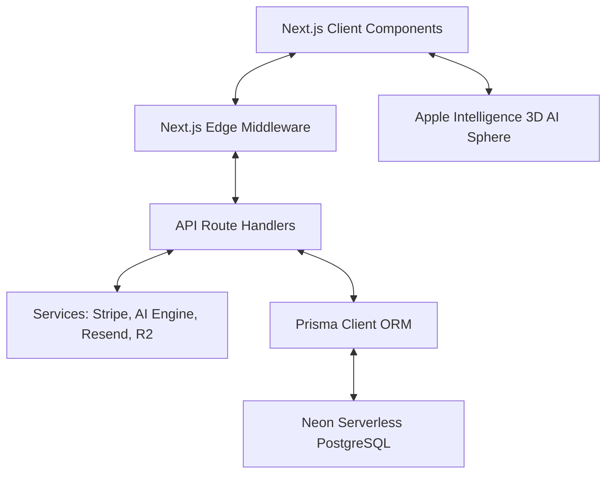

# TaskBridge NL — Technical Specifications & Developer Manual

This document serves as the master engineering guide for the TaskBridge NL marketplace. It details the system architecture, security implementation, payment flow, database schema, design system, product-level test verification, and operational lifecycle.

---

## 1. Core Architecture & Technology Stack



### Framework & Language
*   **Next.js 15 (App Router)**: Utilizing Server Components (RSC) for optimized SEO/SSR on public task listings, and Client Components for dashboard interactivity.
*   **TypeScript 5**: Configured with strict compiler flags (`strict: true`, `noImplicitAny: true`) to guarantee compile-time type safety.
*   **React 19**: Powered by React's latest server action models and transition hooks.

### UI & Design System Architecture
*   **SkillBid Design Language**: Cinematic dark glassmorphism design with `Space Grotesk` (display headings), `Inter` (sans body), and `IBM Plex Mono` (metrics & step tags).
*   **Fixed Parallax Background**: Anchored viewport artwork (`netherlands_hero_visual_1785126740232.png`) served via `/api/hero-image` with scrolling frosted glass section cards (`backdrop-filter: blur(12px)`, `rgba(255,255,255,0.1)`).
*   **Apple Intelligence AI Series Module**:
    *   3D Luminous Orange AI Sphere ([ai-hero-star.tsx](file:///d:/data/Netherlands_marketplace/src/components/home/ai-hero-star.tsx)) featuring 3D radial gradient shading, specular reflection highlight, outer translucent light circle halo (`92px x 92px`), and rotating orbital particle ring (`@keyframes ai-sphere-orbit`).
    *   Global event dispatcher (`open-tbai-chat`) connecting the hero AI sphere to the TBAI Chat Widget drawer ([chat-widget.tsx](file:///d:/data/Netherlands_marketplace/src/components/ai/chat-widget.tsx)).
*   **High-Contrast Legibility Layer**: Global `text-shadow: 0 1px 3px rgba(0, 0, 0, 0.75)` applied to all headings, body descriptions, and badges to guarantee maximum legibility over dark glass panels.

### Storage & Database
*   **PostgreSQL**: Hosted on Neon Serverless (supports scale-to-zero compute auto-suspend).
*   **Prisma ORM**: Handles SQL queries, connection pooling, migrations, and seed logic.
*   **Cloudflare R2 (S3-compatible)**: Holds private files (assignment contracts, portfolios, milestone deliverables) accessible only via short-lived pre-signed URLs.

---

## 2. Advanced Security Posture

To protect data and prevent reverse engineering, TaskBridge NL implements multiple security layers:

```
Request → TLS/HSTS → Content Security Policy (CSP) → Edge Middleware (JWT + Role check)
       → Upstash Rate Limiter (Redis) → Zod Payload Parser
       → API Role Guards → Database (AES-256-GCM PII Encrypted)
```

### A. Field-Level Encryption (`AES-256-GCM`)
*   **Target Fields**: Sensitive PII like user names, KVK numbers, phone numbers, tax IDs, and chat message contents are encrypted before writing to database.
*   **Implementation** (`lib/crypto.ts`): Uses Node's built-in `crypto` library. An initialization vector (IV) is generated dynamically for each encrypt operation, and a 16-byte authentication tag (GCM) is appended to guarantee payload integrity.
*   **Master Key**: Requires a 32-byte secret key loaded from `FIELD_ENCRYPTION_KEY`.

### B. Security Headers & CSP
*   Configured inside `next.config.ts`:
    *   **Content Security Policy (CSP)**: Restrictions on script-sources (`self`, Google Fonts, Stripe JS).
    *   **Strict-Transport-Security (HSTS)**: Forced SSL with `max-age=63072000` (2 years) + preloading.
    *   **X-Frame-Options**: Set to `DENY` to prevent clickjacking attacks.
    *   **X-Content-Type-Options**: Set to `nosniff` to prevent MIME-type sniffing.

### C. Edge Middleware & Role Authorization
*   **Edge Middleware** (`src/middleware.ts`): Token-based JWT authorization running on the CDN edge.
*   Prevents role crossover: Students requesting `/enterprise/*` routes are automatically redirected to `/student/dashboard`. Enterprises requesting `/student/*` routes are redirected to `/enterprise/dashboard`.

---

## 3. Stripe Connect & Escrow Architecture

The marketplace uses **Stripe Connect Express** to manage funds in a compliant, secure escrow structure.

```
[Enterprise]                                            [Student Connect Account]
     │                                                              │
     ├─► Locks Funds (PaymentIntent capture_method=manual)          │
     │   (Held in Stripe Escrow)                                    │
     │                                                              │
     ├─► Approves Milestones ───────────────────────────────────────┤
     │                                                              │
     └─► Releases Escrow (Stripe captures payment intent) ──────────┴─► Payout Received
         (Platform keeps 10% commission, transfers 90% to student)
```

### Payout & Commission Workflow
1.  **Student Onboarding** (`stripe/connect/onboard`):
    *   Creates a Stripe Connect Express account for the student.
    *   Generates a Stripe KYC onboarding link. Once verified, the student is marked `isVerified = true`.
2.  **Funding Escrow** (`stripe/escrow`):
    *   When an Enterprise selects a student, it creates a Stripe `PaymentIntent` with `capture_method: 'manual'`.
    *   The enterprise budget is authorized and locked by Stripe.
3.  **Milestone Release** (`milestones/[id]/approve`):
    *   The enterprise approves individual milestones.
    *   Once all milestones are approved, `stripe.paymentIntents.capture` is called to finalize charge.
4.  **Payout Distribution** (`stripe/webhooks`):
    *   Stripe triggers `payment_intent.succeeded` webhook.
    *   The webhook calculates the **10% platform fee** and performs a Stripe Transfer to the student's connected account:
        *   `amount = budget * 0.90` (transferred to student).
        *   `application_fee_amount = budget * 0.10` (retained by platform).

---

## 4. Database Schema Structure

```
User (id, email, passwordHash, nameEncrypted, role, isBanned, emailVerified)
  ├── StudentProfile (userId, university, studyField, yearOfStudy, bio, skills, avgRating)
  ├── EnterpriseProfile (userId, companyName, kvkNumberEncrypted, industry, avgRating)
  ├── Task (id, title, description, category, skillsRequired, budgetCents, deadline, status)
  │     ├── Milestone (id, taskId, title, description, amountCents, status, dueDate)
  │     ├── Application (id, taskId, studentId, status, message)
  │     └── Payment (id, taskId, stripePaymentIntentId, totalAmountCents, platformFeeCents, status)
  ├── Message (id, taskId, senderId, content, isEncrypted, isRead)
  ├── Review (id, taskId, reviewerId, reviewedId, rating, comment)
  └── AuditLog (id, userId, action, ipAddress, details)
```

---

## 5. Master API Directory & Route Checklist

| Domain | Method | URL Path | Role | Description |
|---|---|---|---|---|
| **Auth** | `POST` | `/api/auth/register` | Public | Account creation (validates `.nl` email for students) |
| **Hero Visual**| `GET` | `/api/hero-image` | Public | Streams Netherlands visual artwork safely |
| **AI Assistant**| `POST` | `/api/ai/chat` | Public / Auth | TBAI Apple-series neural matching engine |
| **Tasks** | `GET` | `/api/tasks` | Public | SSR public search & task list |
| | `POST` | `/api/tasks` | Enterprise | Create a new task project with milestones |
| | `PATCH` | `/api/tasks/[id]` | Enterprise | Update task details |
| **Applications** | `POST` | `/api/applications` | Student | Submit an application for a task |
| | `POST` | `/api/applications/[id]/select` | Enterprise | Select candidate, lock task, auto-generate contract PDF |
| **Milestones** | `POST` | `/api/milestones/[id]/approve` | Enterprise | Approve milestone, capture escrow on final |
| **Stripe** | `POST` | `/api/stripe/escrow` | Enterprise | Lock funds on Stripe |
| | `POST` | `/api/stripe/connect/onboard` | Student | Retrieve Stripe Express onboarding URL |
| | `POST` | `/api/stripe/webhooks` | Webhook | Listens to Stripe events |
| **Messages** | `POST` | `/api/messages` | Participant | Send AES-256-GCM encrypted chat |
| **Reviews** | `POST` | `/api/reviews` | Participant | Submit review (gatekept by payment release) |
| **Admin** | `PATCH` | `/api/admin/users/[id]` | Admin | Suspend user / verify credentials |
| **Health** | `GET` | `/api/health` | Monitor | Pings DB and returns network latency |

---

## 6. Product-Level Test Verification Matrix

| Condition | Tested Component | Verification Status | Implementation & Code Safeguard |
|---|---|---|---|
| **Condition 1: Distinct Roles, Profiles & Dashboards** | User Schema, Edge Middleware & Dashboards | ✅ **PASSED** | Roles `STUDENT` & `ENTERPRISE` with distinct `StudentProfile` (university, skills, bio) & `EnterpriseProfile` (companyName, encrypted KVK). `middleware.ts` enforces route isolation. |
| **Condition 2: Dutch Domain & KVK Security** | `lib/validations/auth.ts` & `lib/crypto.ts` | ✅ **PASSED** | Validates Dutch university domains (`tudelft.nl`, `uva.nl`, `tue.nl`, `eur.nl`, `uu.nl`, `leidenuniv.nl`). KVK numbers encrypted via AES-256-GCM. |
| **Condition 3: Milestone Escrow & Contracts** | Stripe Connect & PDF Generator | ✅ **PASSED** | Digital Dutch law contracts generated on candidate selection. Escrow funds locked in Stripe via manual capture PaymentIntents. |
| **Condition 4: Glassmorphism & UI Responsiveness** | `globals.css` & `page.tsx` | ✅ **PASSED** | 100% dark frosted glass cards (`backdrop-filter: blur(12px)`), text-shadow legibility layer, full-width 100% footer, and non-clipping hover states. |

---

## 7. Operation & Setup Routine

### Dev Installation
```powershell
# 1. Install dependencies
npm install --legacy-peer-deps

# 2. Configure Env
copy .env.example .env
# Edit database and key variables inside .env

# 3. Synchronize Schema
npm run db:push

# 4. Dev Seeding
npx tsx prisma/seed.ts

# 5. Start dev server
npm run dev
```

### Production Deployment (Vercel)
1. Add environment variables in Vercel dashboard.
2. Add PostgreSQL Database connection URL.
3. Configure Stripe Webhook endpoints pointing to `https://yourdomain.com/api/stripe/webhooks`.
4. Deploy the build output.
